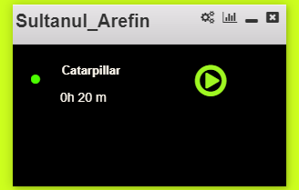

# ArElectronRepo

**This app was made with Electron.** 

Technology used: several electron packages (npm electron, jquery, font-awesome etc.) were used, the main task was to take screen shot in every minute
 when play button is on, and when play button was turned off no screen shot will be taken. coding and designing was performed by me.
 
 
if you are facing problem in running this application: please check below link
.
https://electronjs.org/docs/tutorial/first-app

steps: 
1) install nodejs
2) install electron locally and this dependencies too:
	`npm install --verbose electron`
	`npm install --save-dev devtron`
	`npm install electron-debug`,
	`npm install` as far as i can remember.
	`npm i moment  --save-dev`
	`npm i jquery --save-dev`
	`npm i desktop-screenshot --save-dev`

**npm install will install all of them if listed in package.json file.** 

4) From project root run this `starter.bat`

5) finally press F12 to get a good view like this below.

[Twitter](https://twitter.com/mdsultanul)

[LinkedIn](https://linkedin.com/in/mdarefin28/)

Thanks!

-Md. Sultanul Arefin
